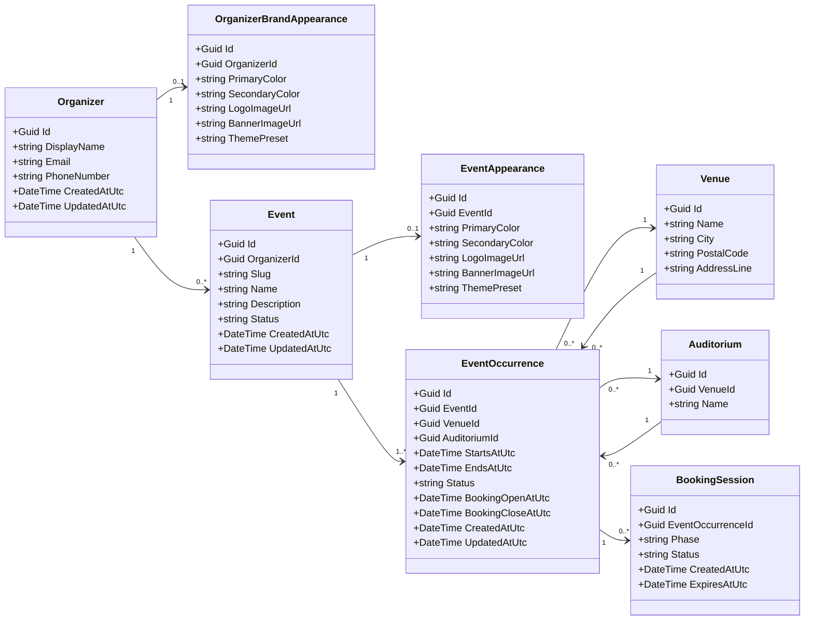

# Organizer, Branding, Event, and EventOccurrence Architecture

## Overview

This document describes the architecture and relationships between the following entities:

- Organizer
- OrganizerBrand
- Event
- EventAppearance
- EventOccurrence

These entities define the **content, scheduling, and visual presentation layer** of the event platform.

The system separates:

- organizer ownership
- organizer-level branding
- event definition
- event-specific appearance
- occurrence-specific scheduling

This design allows events to inherit default branding while still supporting event-level visual customization and occurrence-level scheduling.

---

# Domain Responsibilities

This part of the system has five main responsibilities:

1. Managing organizers and their ownership boundaries.
2. Managing organizer-level branding defaults.
3. Managing event definitions.
4. Managing event-specific visual appearance overrides.
5. Managing scheduled event occurrences.

---

# Entity Relationships

## Ownership and scheduling structure

```text
Organizer
├── OrganizerBrand
├── Events
│    ├── EventAppearance
│    └── EventOccurrences
└── Venues
     └── Auditoriums
```

Key rules:

- Each organizer may define one default **OrganizerBrand**.
- Each event belongs to exactly one organizer.
- Each event may define one optional **EventAppearance**.
- Each event may define multiple **EventOccurrences**.
- If an event does not define its own appearance, the public event page falls back to the **OrganizerBrand**.
- Booking is tied to **EventOccurrence**, not directly to **Event**.

---

# Entities

## Organizer

Represents the event organizer and owner of the organizer-facing configuration.

The organizer owns:

- venues
- events
- organizer branding

Example JSON:

```json
{
  "id": "org-001",
  "displayName": "Cinema City",
  "email": "contact@cinemacity.com",
  "phoneNumber": "+361234567",
  "createdAt": "2026-03-10T12:00:00Z"
}
```

Relationships:

```text
Organizer 1 → N Event
Organizer 1 → N Venue
Organizer 1 → 0..1 OrganizerBrand
```

---

## OrganizerBrand

Defines the default visual identity of the organizer.

This configuration is used automatically when an event does not define its own appearance.

Typical properties:

- primary color
- secondary color
- logo
- banner
- optional background image

Example JSON:

```json
{
  "id": "brand-001",
  "organizerId": "org-001",
  "primaryColor": "#2563EB",
  "secondaryColor": "#1E40AF",
  "logoUrl": "/assets/organizers/org-001/logo.png",
  "bannerUrl": "/assets/organizers/org-001/banner.png",
  "backgroundImageUrl": "/assets/organizers/org-001/background.jpg"
}
```

Relationship:

```text
Organizer 1 → 0..1 OrganizerBrand
```

---

## Event

Represents the conceptual event.

Examples:

- movie
- concert
- theatre performance
- conference session

An event contains descriptive and public-facing metadata, but it does **not** represent a specific scheduled instance.

Scheduling is handled through **EventOccurrence**.

Typical event data:

- name
- description
- slug
- publication status
- visibility settings

Example JSON:

```json
{
  "id": "event-001",
  "organizerId": "org-001",
  "name": "Dune Part II",
  "description": "Sci-fi movie screening",
  "slug": "dune-part-2",
  "isPublic": true,
  "status": "Published",
  "createdAt": "2026-03-10T14:00:00Z"
}
```

Relationships:

```text
Organizer 1 → N Event
Event 1 → 0..1 EventAppearance
Event 1 → N EventOccurrence
```

---

## EventAppearance

Defines the visual appearance of a specific event page.

This entity overrides the organizer’s default brand on the event page.

If an event appearance does not exist, the system falls back to the organizer brand.

Typical properties:

- primary color
- secondary color
- banner
- poster
- optional background image

Example JSON:

```json
{
  "id": "appearance-001",
  "eventId": "event-001",
  "primaryColor": "#DC2626",
  "secondaryColor": "#991B1B",
  "bannerUrl": "/assets/events/event-001/banner.jpg",
  "posterUrl": "/assets/events/event-001/poster.jpg",
  "backgroundImageUrl": "/assets/events/event-001/background.jpg"
}
```

Relationship:

```text
Event 1 → 0..1 EventAppearance
```

---

## EventOccurrence

Represents a concrete scheduled instance of an event.

Examples:

- Dune Part II on March 20 at 18:00
- Dune Part II on March 20 at 21:00
- Dune Part II on March 22 at 17:00

This is the entity that connects the event to the actual operational context:

- specific start/end time
- venue
- auditorium
- booking window
- later booking records

This means that the bookable unit is **EventOccurrence**, not the Event itself.

Example JSON:

```json
{
  "id": "occ-001",
  "eventId": "event-001",
  "venueId": "venue-001",
  "auditoriumId": "aud-001",
  "startsAt": "2026-03-20T18:00:00Z",
  "endsAt": "2026-03-20T20:30:00Z",
  "status": "Published",
  "bookingOpenAt": "2026-03-01T08:00:00Z",
  "bookingCloseAt": "2026-03-20T17:45:00Z"
}
```

Relationships:

```text
Event 1 → N EventOccurrence
EventOccurrence N → 1 Venue
EventOccurrence N → 1 Auditorium
```

---

# Appearance Resolution Logic

When rendering the public event page, the system resolves the visual configuration in the following order:

1. Check whether the event has an `EventAppearance`.
2. If it exists, use it.
3. Otherwise use the organizer-level `OrganizerBrand`.

Resolution rule:

```text
EventAppearance ?? OrganizerBrand
```

This guarantees that every public event page has a valid appearance configuration.

---

# Scheduling Logic

An `Event` is a reusable content entity.

An `EventOccurrence` is a scheduled, bookable instance of that event.

Example:

```json
{
  "event": {
    "id": "event-001",
    "name": "Dune Part II"
  },
  "occurrences": [
    {
      "id": "occ-001",
      "startsAt": "2026-03-20T18:00:00Z",
      "auditoriumId": "aud-001"
    },
    {
      "id": "occ-002",
      "startsAt": "2026-03-20T21:00:00Z",
      "auditoriumId": "aud-001"
    }
  ]
}
```

This allows a single event page to expose multiple available time slots.

---

# Public Event Page Data

When loading the public event page, the frontend may call:

```text
GET /api/events/{slug}
```

Example response:

```json
{
  "event": {
    "id": "event-001",
    "name": "Dune Part II",
    "description": "Sci-fi movie screening",
    "slug": "dune-part-2"
  },
  "appearance": {
    "primaryColor": "#DC2626",
    "secondaryColor": "#991B1B",
    "bannerUrl": "/assets/events/event-001/banner.jpg",
    "posterUrl": "/assets/events/event-001/poster.jpg"
  },
  "occurrences": [
    {
      "id": "occ-001",
      "startsAt": "2026-03-20T18:00:00Z",
      "endsAt": "2026-03-20T20:30:00Z",
      "venueId": "venue-001",
      "auditoriumId": "aud-001"
    },
    {
      "id": "occ-002",
      "startsAt": "2026-03-20T21:00:00Z",
      "endsAt": "2026-03-20T23:30:00Z",
      "venueId": "venue-001",
      "auditoriumId": "aud-001"
    }
  ]
}
```

If the event has no event-specific appearance, the `appearance` object should be resolved from `OrganizerBrand`.

---

# API Endpoints

## Organizer

```text
GET /api/organizers/{id}
```

---

## OrganizerBrand

Create or update organizer-level branding.

```text
PUT /api/organizers/{organizerId}/brand
```

Example request:

```json
{
  "primaryColor": "#2563EB",
  "secondaryColor": "#1E40AF",
  "logoUrl": "/assets/logo.png",
  "bannerUrl": "/assets/banner.png"
}
```

---

## Event

Create a new event.

```text
POST /api/events
```

Example request:

```json
{
  "organizerId": "org-001",
  "name": "Dune Part II",
  "description": "Sci-fi movie screening",
  "slug": "dune-part-2",
  "isPublic": true
}
```

---

## EventAppearance

Create or update event-specific appearance.

```text
PUT /api/events/{eventId}/appearance
```

Example request:

```json
{
  "primaryColor": "#DC2626",
  "secondaryColor": "#991B1B",
  "bannerUrl": "/assets/events/event-001/banner.jpg",
  "posterUrl": "/assets/events/event-001/poster.jpg"
}
```

---

## EventOccurrence

Create or update an occurrence under an event.

```text
POST /api/events/{eventId}/occurrences
PUT /api/occurrences/{occurrenceId}
GET /api/events/{eventId}/occurrences
```

Example create request:

```json
{
  "venueId": "venue-001",
  "auditoriumId": "aud-001",
  "startsAt": "2026-03-20T18:00:00Z",
  "endsAt": "2026-03-20T20:30:00Z",
  "bookingOpenAt": "2026-03-01T08:00:00Z",
  "bookingCloseAt": "2026-03-20T17:45:00Z"
}
```

Example create response:

```json
{
  "id": "occ-001",
  "eventId": "event-001",
  "venueId": "venue-001",
  "auditoriumId": "aud-001",
  "startsAt": "2026-03-20T18:00:00Z",
  "endsAt": "2026-03-20T20:30:00Z",
  "status": "Draft"
}
```

---

# Domain diagram



# Architectural Summary

Organizer-level entities:

- Organizer
- OrganizerBrand

Event-level entities:

- Event
- EventAppearance

Scheduling-level entity:

- EventOccurrence

Core rules:

- Organizer owns events and organizer branding.
- OrganizerBrand acts as the default visual style.
- EventAppearance is an optional event-level override.
- Event may have multiple EventOccurrences.
- Booking and seat availability must be tied to EventOccurrence.
- The public event page combines event data, resolved appearance, and available occurrences.

Inheritance rule:

```text
EventAppearance → overrides → OrganizerBrand
```
