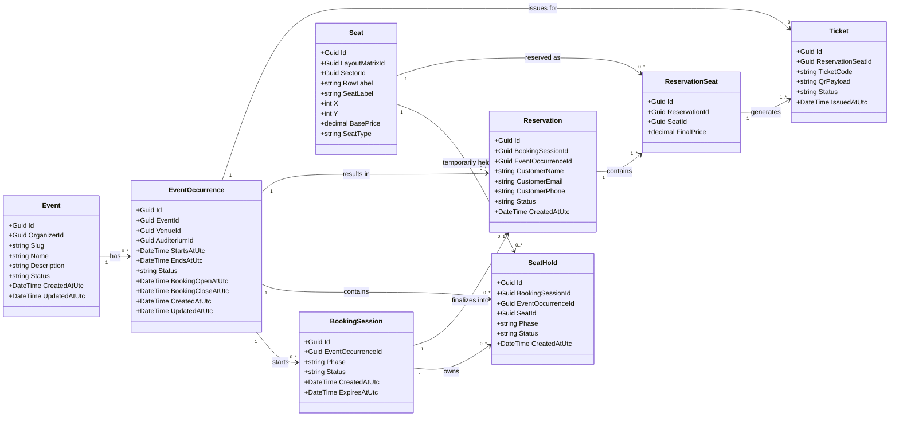

# Booking Flow Architecture

## Overview

This document summarizes the booking flow architecture for the ticket booking platform.

The scope of this document is limited to the **booking process** and the architectural elements directly required to support it.

According to the current product direction:

* the customer selects seats on the public booking page
* the customer proceeds to a checkout page
* the system finalizes the reservation
* tickets are generated with QR data
* confirmation is sent by email
* organizers can review reservations on the admin side

In the current MVP, **there is no online payment**.

The goal of the flow is:

* seat selection
* temporary seat holding
* customer data submission
* reservation finalization
* ticket generation
* email confirmation

---

# Core Principle

The bookable unit of the system is **EventOccurrence**, not Event.

Meaning:

* `Event` represents the content entity
* `EventOccurrence` represents a scheduled instance of the event
* booking, seat availability, holds, reservations, and tickets must all be tied to `EventOccurrence`

Seat availability must always be evaluated in the context of:

```
Seat + EventOccurrence
```

---

# Main Concepts

## BookingSession

Represents the customer's active booking flow for a specific `EventOccurrence`.

Responsibilities:

* grouping the customer's temporary booking work
* tracking the phase of the booking process
* storing expiration time
* linking seat holds belonging to the same session

### Fields

* `Id`
* `EventOccurrenceId`
* `Phase`
* `Status`
* `CreatedAtUtc`
* `ExpiresAtUtc`

### Phase values

* `Selection`
* `Checkout`

### Status values

* `Active`
* `Completed`
* `Expired`
* `Cancelled`

---

## SeatHold

Represents a temporary reservation of a seat during seat selection.

Responsibilities:

* preventing other sessions from selecting the same seat
* linking the seat to the booking session
* automatically expiring if the user leaves or times out

### Fields

* `Id`
* `BookingSessionId`
* `EventOccurrenceId`
* `SeatId`
* `Status`
* `CreatedAtUtc`

### Status values

* `Held`
* `Released`
* `Expired`
* `Converted`

---

## Reservation

Represents a finalized booking created from a valid `BookingSession`.

Responsibilities:

* storing customer information
* grouping all seats reserved in the booking

### Fields

* `Id`
* `BookingSessionId`
* `EventOccurrenceId`
* `CustomerName`
* `CustomerEmail`
* `CustomerPhone`
* `Status`
* `CreatedAtUtc`

### Status values

* `Confirmed`
* `Cancelled`

---

## ReservationSeat

Represents the association between a `Reservation` and a `Seat`.

This entity exists because:

* one reservation can contain multiple seats
* seat specific booking information must be stored

Responsibilities:

* linking seats to a reservation
* storing seat specific booking information

Example JSON:

```json
{
  "id": "rs_001",
  "reservationId": "res_001",
  "seatId": "seat_A_12",
  "finalPrice": 6500
}
```

---

## Ticket

Represents the entry ticket generated for a reserved seat.

A ticket is generated **per ReservationSeat**.

Responsibilities:

* providing a unique ticket identifier
* storing the QR payload used for validation
* linking the ticket to the reserved seat

Example JSON:

```json
{
  "id": "tkt_001",
  "reservationSeatId": "rs_001",
  "ticketCode": "TGX9-4M2Q-8L1P",
  "qrPayload": "ticket:tkt_001:TGX9-4M2Q-8L1P",
  "status": "Valid",
  "issuedAtUtc": "2026-03-12T18:05:10Z"
}
```

---

# Seat Availability Model

Seat availability is not stored as a field on the `Seat` entity.

Instead it is derived from the booking state for a specific `EventOccurrence`.

Possible states:

* **Available** – no active hold and no reservation
* **Held** – active `SeatHold` exists
* **Booked** – `ReservationSeat` exists

---

# Booking Session Phases

Booking sessions move through the following phases:

```
Selection -> Checkout -> Completed
                     -> Cancelled
                     -> Expired
```

---

# Booking Flow

## 1 Public Event Page

User opens the public event page and selects an occurrence.

System loads:

* event data
* occurrence data
* seat layout
* seat availability

---

## 2 First Seat Selection

When a seat is clicked:

* booking session is created if it does not exist
* seat hold record is created

Seat state becomes **Held**.

---

## 3 Additional Seat Selection

Each seat selected:

* belongs to the same booking session
* creates an additional `SeatHold`

---

## 4 Seat Removal

When the user deselects a seat:

* `SeatHold` is removed or released

Seat state becomes **Available** again.

---

## 5 Checkout

User proceeds to checkout.

System:

* changes session phase to `Checkout`
* keeps seat holds active

---

## 6 Reservation Finalization

The backend performs validation:

* booking session is still active
* holds still exist
* holds belong to the same session

Then inside **a single database transaction**:

1. Reservation is created
2. ReservationSeat entries are created
3. Tickets are generated
4. SeatHold records are marked as converted

Seat state becomes **Booked**.

---

# Core Entities

## Event

```json
{
  "id": "evt_001",
  "organizerId": "org_001",
  "slug": "spring-concert-2026",
  "name": "Spring Concert",
  "description": "Annual spring concert",
  "status": "Published",
  "createdAtUtc": "2026-01-01T10:00:00Z",
  "updatedAtUtc": "2026-01-10T12:00:00Z"
}
```

---

## EventOccurrence

```json
{
  "id": "occ_001",
  "eventId": "evt_001",
  "venueId": "ven_001",
  "auditoriumId": "aud_001",
  "startsAtUtc": "2026-04-20T18:00:00Z",
  "endsAtUtc": "2026-04-20T20:00:00Z",
  "status": "Published",
  "bookingOpenAtUtc": "2026-03-01T10:00:00Z",
  "bookingCloseAtUtc": "2026-04-20T17:45:00Z",
  "createdAtUtc": "2026-01-01T10:05:00Z",
  "updatedAtUtc": "2026-01-10T12:00:00Z"
}
```

---

## Seat

```json
{
  "id": "seat_A_12",
  "layoutMatrixId": "layout_001",
  "sectorId": "sector_A",
  "rowLabel": "A",
  "seatLabel": "12",
  "x": 12,
  "y": 1,
  "basePrice": 6500,
  "priceOverride": null,
  "seatType": "Standard"
}
```

---

## BookingSession

```json
{
  "id": "bs_001",
  "eventOccurrenceId": "occ_001",
  "phase": "Selection",
  "status": "Active",
  "createdAtUtc": "2026-03-12T18:00:00Z",
  "expiresAtUtc": "2026-03-12T18:10:00Z"
}
```

---

## SeatHold

```json
{
  "id": "hold_001",
  "bookingSessionId": "bs_001",
  "eventOccurrenceId": "occ_001",
  "seatId": "seat_A_12",
  "status": "Held",
  "createdAtUtc": "2026-03-12T18:02:00Z"
}
```

---

## Reservation

```json
{
  "id": "res_001",
  "bookingSessionId": "bs_001",
  "eventOccurrenceId": "occ_001",
  "customerName": "John Doe",
  "customerEmail": "test@example.com",
  "customerPhone": "+36123456789",
  "status": "Confirmed",
  "createdAtUtc": "2026-03-12T18:05:00Z"
}
```

---

## ReservationSeat

```json
{
  "id": "rs_001",
  "reservationId": "res_001",
  "seatId": "seat_A_12",
  "finalPrice": 6500
}
```
---

## Ticket

```json
{
  "id": "tkt_001",
  "reservationSeatId": "rs_001",
  "ticketCode": "TGX9-4M2Q-8L1P",
  "qrPayload": "ticket:tkt_001:TGX9-4M2Q-8L1P",
  "status": "Valid",
  "issuedAtUtc": "2026-03-12T18:05:10Z"
}
```
---

# API Summary

## Get Public Event

```
GET /api/public/events/{slug}
```

---

## Get Occurrence Seat Map

```
GET /api/public/occurrences/{eventOccurrenceId}/seat-map
```

---

## Create Booking Session

```
POST /api/public/booking-sessions
```

---

## Hold Seat

```
POST /api/public/booking-sessions/{bookingSessionId}/holds
```

---

## Release Seat

```
DELETE /api/public/booking-sessions/{bookingSessionId}/holds/{seatId}
```

---

## Move Session to Checkout

```
POST /api/public/booking-sessions/{bookingSessionId}/checkout
```

---

## Create Reservation

```
POST /api/public/reservations
```

---

## Get Reservation

```
GET /api/public/reservations/{reservationId}
```

---

# Concurrency Rules

Two customers must never reserve the same seat simultaneously.

Key rules:

* backend is the source of truth
* hold creation must be atomic
* reservation creation must run inside a transaction
* expired sessions release holds

---

# Domain Diagram



---

# Summary

The booking subsystem centers around `BookingSession`, which manages seat holds and transitions into a finalized `Reservation`.

Seats selected by the user become `SeatHold` records. When the booking is finalized, `ReservationSeat` entities are created to associate seats with the reservation, and `Ticket` objects are generated for entry validation.

This architecture supports:

* multiple occurrences per event
* reusable seat layouts
* temporary seat locking
* safe reservation finalization
* reliable ticket generation
