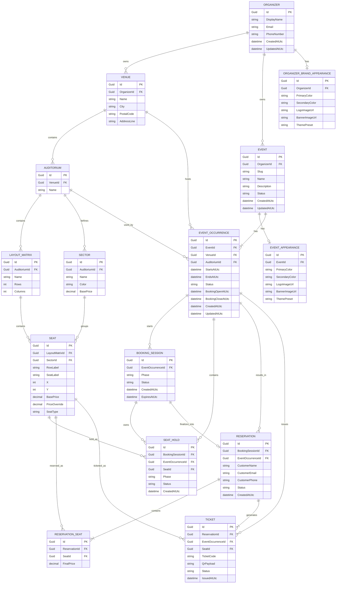

# Database Entity Relationship Diagram

```mermaid
erDiagram
    ORGANIZER {
        Guid Id PK
        string DisplayName
        string Email
        string PhoneNumber
        datetime CreatedAtUtc
        datetime UpdatedAtUtc
    }

    ORGANIZER_BRAND_APPEARANCE {
        Guid Id PK
        Guid OrganizerId FK
        string PrimaryColor
        string SecondaryColor
        string LogoImageUrl
        string BannerImageUrl
        string ThemePreset
    }

    VENUE {
        Guid Id PK
        Guid OrganizerId FK
        string Name
        string City
        string PostalCode
        string AddressLine
    }

    AUDITORIUM {
        Guid Id PK
        Guid VenueId FK
        string Name
    }

    LAYOUT_MATRIX {
        Guid Id PK
        Guid AuditoriumId FK
        string Name
        int Rows
        int Columns
    }

    SECTOR {
        Guid Id PK
        Guid AuditoriumId FK
        string Name
        string Color
        decimal BasePrice
    }

    SEAT {
        Guid Id PK
        Guid LayoutMatrixId FK
        Guid SectorId FK
        string RowLabel
        string SeatLabel
        int X
        int Y
        decimal BasePrice
        decimal PriceOverride
        string SeatType
    }

    EVENT {
        Guid Id PK
        Guid OrganizerId FK
        string Slug
        string Name
        string Description
        string Status
        datetime CreatedAtUtc
        datetime UpdatedAtUtc
    }

    EVENT_APPEARANCE {
        Guid Id PK
        Guid EventId FK
        string PrimaryColor
        string SecondaryColor
        string LogoImageUrl
        string BannerImageUrl
        string ThemePreset
    }

    EVENT_OCCURRENCE {
        Guid Id PK
        Guid EventId FK
        Guid VenueId FK
        Guid AuditoriumId FK
        datetime StartsAtUtc
        datetime EndsAtUtc
        string Status
        datetime BookingOpenAtUtc
        datetime BookingCloseAtUtc
        datetime CreatedAtUtc
        datetime UpdatedAtUtc
    }

    BOOKING_SESSION {
        Guid Id PK
        Guid EventOccurrenceId FK
        string Phase
        string Status
        datetime CreatedAtUtc
        datetime ExpiresAtUtc
    }

    SEAT_HOLD {
        Guid Id PK
        Guid BookingSessionId FK
        Guid EventOccurrenceId FK
        Guid SeatId FK
        string Phase
        string Status
        datetime CreatedAtUtc
    }

    RESERVATION {
        Guid Id PK
        Guid BookingSessionId FK
        Guid EventOccurrenceId FK
        string CustomerName
        string CustomerEmail
        string CustomerPhone
        string Status
        datetime CreatedAtUtc
    }

    RESERVATION_SEAT {
        Guid Id PK
        Guid ReservationId FK
        Guid SeatId FK
        decimal FinalPrice
    }

    TICKET {
        Guid Id PK
        Guid ReservationId FK
        Guid EventOccurrenceId FK
        Guid SeatId FK
        string TicketCode
        string QrPayload
        string Status
        datetime IssuedAtUtc
    }

    ORGANIZER ||--o{ VENUE : owns
    ORGANIZER ||--o{ EVENT : owns
    ORGANIZER ||--o| ORGANIZER_BRAND_APPEARANCE : has

    VENUE ||--o{ AUDITORIUM : contains
    AUDITORIUM ||--o{ LAYOUT_MATRIX : contains
    AUDITORIUM ||--o{ SECTOR : defines
    LAYOUT_MATRIX ||--o{ SEAT : contains
    SECTOR ||--o{ SEAT : groups

    EVENT ||--o| EVENT_APPEARANCE : has
    EVENT ||--|{ EVENT_OCCURRENCE : has

    VENUE ||--o{ EVENT_OCCURRENCE : hosts
    AUDITORIUM ||--o{ EVENT_OCCURRENCE : used_by

    EVENT_OCCURRENCE ||--o{ BOOKING_SESSION : starts
    EVENT_OCCURRENCE ||--o{ SEAT_HOLD : contains
    BOOKING_SESSION ||--o{ SEAT_HOLD : owns
    SEAT ||--o{ SEAT_HOLD : held_as

    BOOKING_SESSION ||--o| RESERVATION : finalizes_into
    EVENT_OCCURRENCE ||--o{ RESERVATION : results_in
    RESERVATION ||--|{ RESERVATION_SEAT : contains
    SEAT ||--o{ RESERVATION_SEAT : reserved_as

    EVENT_OCCURRENCE ||--o{ TICKET : issues
    RESERVATION ||--|{ TICKET : generates
    SEAT ||--o{ TICKET : ticketed_as
```