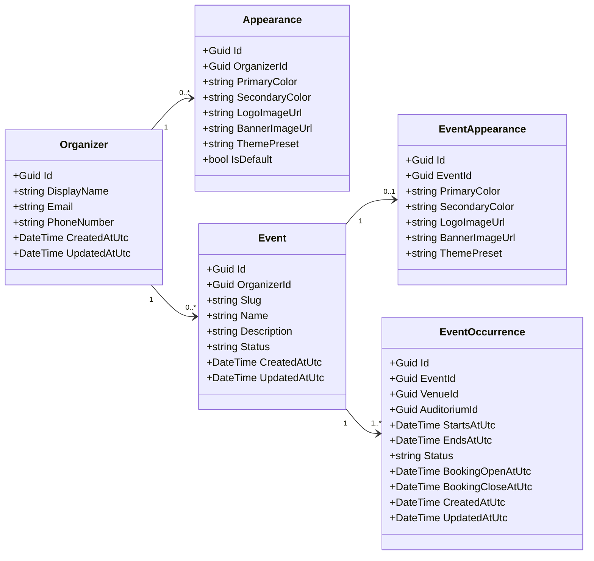

# Organizer, Branding, Event, and EventOccurrence Architecture

## Overview

This document describes the architecture and relationships between the following entities:

- Organizer
- Appearance (Global default branding)
- Event
- EventAppearance
- EventOccurrence

These entities define the **content, scheduling, and visual presentation layer** of the event platform.

The system separates:

- organizer ownership
- organizer-level branding
- event definition
- event-specific appearance
- occurrence-specific scheduling

This design allows events to inherit default branding while still supporting event-level visual customization and occurrence-level scheduling.

---

# Domain Responsibilities

This part of the system has five main responsibilities:

1. Managing organizers and their ownership boundaries.
2. Managing organizer-level branding defaults.
3. Managing event definitions.
4. Managing event-specific visual appearance overrides.
5. Managing scheduled event occurrences.

---

# Entity Relationships

## Ownership and scheduling structure

```
Organizer
├── OrganizerBrand
├── Events
│    ├── EventAppearance
│    └── EventOccurrences
└── Venues
     └── Auditoriums
```

Key rules:

- Each organizer may define one default **Appearance**.
- Each event belongs to exactly one organizer.
- Each event may define one optional **EventAppearance**.
- Each event may define multiple **EventOccurrences**.
- If an event does not define its own appearance, the public event page falls back to the organizer's **Appearance**.
- Booking is tied to **EventOccurrence**, not directly to **Event**.

---

# Entities

## Organizer

Represents the event organizer and owner of the organizer-facing configuration.

The organizer owns:

- venues
- events
- organizer branding

Example JSON:

```json
{
  "id": "org-001",
  "displayName": "Cinema City",
  "email": "contact@cinemacity.com",
  "phoneNumber": "+361234567",
  "createdAtUtc": "2026-03-10T12:00:00Z",
  "updatedAtUtc": "2026-03-10T12:00:00Z"
}
```

Relationships:

```
Organizer 1 → N Event
Organizer 1 → N Venue
Organizer 1 → 0..1 OrganizerBrand
```

---

## Appearance

Defines the default visual identity of the organizer.

This configuration is used automatically when an event does not define its own appearance. An organizer can have multiple appearances, but one is usually marked as default.

Typical properties:

- primary color
- secondary color
- logo
- banner
- theme preset
- isDefault

Example JSON:

```json
{
  "id": "brand-001",
  "organizerId": "org-001",
  "primaryColor": "#2563EB",
  "secondaryColor": "#1E40AF",
  "logoImageUrl": "/assets/organizers/org-001/logo.png",
  "bannerImageUrl": "/assets/organizers/org-001/banner.png",
  "themePreset": "default",
  "isDefault": true
}
```

Relationship:

```
Organizer 1 → N Appearance
```

---

## Event

Represents the conceptual event.

Examples:

- movie
- concert
- theatre performance
- conference session

An event contains descriptive and public-facing metadata, but it does **not** represent a specific scheduled instance.

Scheduling is handled through **EventOccurrence**.

Typical event data:

- name
- description
- slug
- publication status

Example JSON:

```json
{
  "id": "event-001",
  "organizerId": "org-001",
  "name": "Dune Part II",
  "description": "Sci-fi movie screening",
  "slug": "dune-part-2",
  "status": "Published",
  "createdAtUtc": "2026-03-10T14:00:00Z",
  "updatedAtUtc": "2026-03-10T14:00:00Z"
}
```

Relationships:

```
Organizer 1 → N Event
Event 1 → 0..1 EventAppearance
Event 1 → N EventOccurrence
```

---

## EventAppearance

Defines the visual appearance of a specific event page.

This entity overrides the organizer’s default brand on the event page.

If an event appearance does not exist, the system falls back to the organizer brand.

Typical properties:

- primary color
- secondary color
- banner
- logo
- theme preset

Example JSON:

```json
{
  "id": "appearance-001",
  "eventId": "event-001",
  "primaryColor": "#DC2626",
  "secondaryColor": "#991B1B",
  "logoImageUrl": "/assets/events/event-001/logo.png",
  "bannerImageUrl": "/assets/events/event-001/banner.jpg",
  "themePreset": "cinema"
}
```

Relationship:

```
Event 1 → 0..1 EventAppearance
```

---

## EventOccurrence

Represents a concrete scheduled instance of an event.

Examples:

- Dune Part II on March 20 at 18:00
- Dune Part II on March 20 at 21:00
- Dune Part II on March 22 at 17:00

This is the entity that connects the event to the operational context:

- specific start/end time
- venue
- auditorium
- booking window

The bookable unit is **EventOccurrence**, not the Event itself.

Example JSON:

```json
{
  "id": "occ-001",
  "eventId": "event-001",
  "venueId": "venue-001",
  "auditoriumId": "aud-001",
  "startsAtUtc": "2026-03-20T18:00:00Z",
  "endsAtUtc": "2026-03-20T20:30:00Z",
  "status": "Published",
  "bookingOpenAtUtc": "2026-03-01T08:00:00Z",
  "bookingCloseAtUtc": "2026-03-20T17:45:00Z",
  "doorsOpenAtUtc": "2026-03-20T17:30:00Z",
  "createdAtUtc": "2026-03-10T14:10:00Z",
  "updatedAtUtc": "2026-03-10T14:10:00Z"
}
```

Relationships:

```
Event 1 → N EventOccurrence
EventOccurrence N → 1 Venue
EventOccurrence N → 1 Auditorium
```

---

# Appearance Resolution Logic

When rendering the public event page, the system resolves the visual configuration in the following order:

1. Check whether the event has an `EventAppearance`.
2. If it exists, use it.
3. Otherwise use the organizer-level default `Appearance`.

Resolution rule:

```
EventAppearance ?? Appearance(where isDefault=true)
```

This guarantees that every public event page has a valid appearance configuration.

---

# Scheduling Logic

An `Event` is a reusable content entity.

An `EventOccurrence` is a scheduled, bookable instance of that event.

Example:

```json
{
  "event": {
    "id": "event-001",
    "name": "Dune Part II"
  },
  "occurrences": [
    {
      "id": "occ-001",
      "startsAtUtc": "2026-03-20T18:00:00Z",
      "auditoriumId": "aud-001"
    },
    {
      "id": "occ-002",
      "startsAtUtc": "2026-03-20T21:00:00Z",
      "auditoriumId": "aud-001"
    }
  ]
}
```

This allows a single event page to expose multiple available time slots.

---

# Public Event Page Data

When loading the public event page, the frontend may call:

```
GET /api/events/{slug}
```

Example response:

```json
{
  "event": {
    "id": "event-001",
    "name": "Dune Part II",
    "description": "Sci-fi movie screening",
    "slug": "dune-part-2"
  },
  "appearance": {
    "primaryColor": "#DC2626",
    "secondaryColor": "#991B1B",
    "bannerImageUrl": "/assets/events/event-001/banner.jpg",
    "logoImageUrl": "/assets/events/event-001/logo.png"
  },
  "occurrences": [
    {
      "id": "occ-001",
      "startsAtUtc": "2026-03-20T18:00:00Z",
      "endsAtUtc": "2026-03-20T20:30:00Z",
      "venueId": "venue-001",
      "auditoriumId": "aud-001"
    }
  ]
}
```

If the event has no event-specific appearance, the `appearance` object is resolved from `OrganizerBrand`.

---

# Domain Diagram

